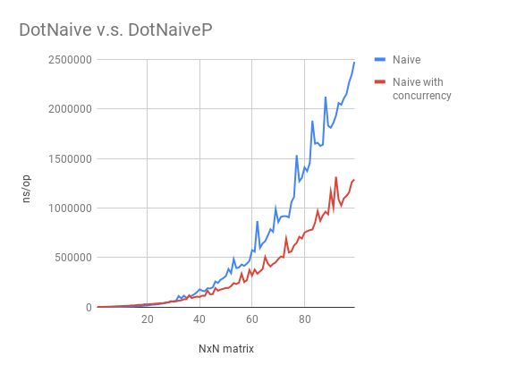

# Benchmarks

This document illustrates the general benchmark results of `gomat`.

Matrix operation is highly tricky and hardware specific.
As a caller, it is your responsbility to measure the performance of various APIs 
provided by this package on your platform and choose the best solution.

## Hardware & Software

The following results are based on the following hardware and software:

```bash
→ system_profiler SPHardwareDataType
Hardware:

    Hardware Overview:

      Model Name: MacBook
      Model Identifier: MacBook10,1
      Processor Name: Intel Core i7
      Processor Speed: 1.4 GHz
      Number of Processors: 1
      Total Number of Cores: 2
      L2 Cache (per Core): 256 KB
      L3 Cache: 4 MB
      Memory: 16 GB
```

```bash
→ go env
GOARCH="amd64"
GOBIN=""
GOCACHE="/Users/changkun/Library/Caches/go-build"
GOEXE=""
GOFLAGS=""
GOHOSTARCH="amd64"
GOHOSTOS="darwin"
GOOS="darwin"
GOPATH="/Users/changkun/dev/golang"
GOPROXY=""
GORACE=""
GOROOT="/usr/local/Cellar/go/1.11/libexec"
GOTMPDIR=""
GOTOOLDIR="/usr/local/Cellar/go/1.11/libexec/pkg/tool/darwin_amd64"
GCCGO="gccgo"
CC="clang"
CXX="clang++"
CGO_ENABLED="1"
GOMOD=""
CGO_CFLAGS="-g -O2"
CGO_CPPFLAGS=""
CGO_CXXFLAGS="-g -O2"
CGO_FFLAGS="-g -O2"
CGO_LDFLAGS="-g -O2"
PKG_CONFIG="pkg-config"
GOGCCFLAGS="-fPIC -m64 -pthread -fno-caret-diagnostics -Qunused-arguments -fmessage-length=0 -fdebug-prefix-map=/var/folders/61/r39b4cjx2bggk1_p7pmpbrdw0000gn/T/go-build040582231=/tmp/go-build -gno-record-gcc-switches -fno-common"
```

## Matrix Multiplication: Naive v.s. Naive with concurrency



## Matrix Multiplication: Tiling v.s. Tiling with concurrency

TODO